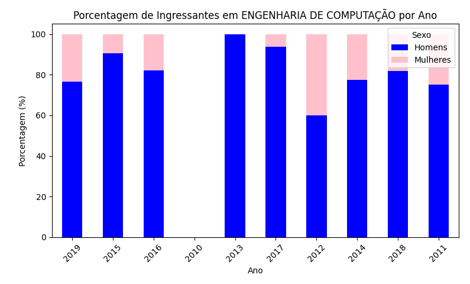
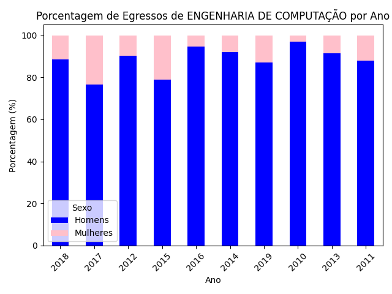

# Simple Data Analysis of UFRN Students Based on Gender

## Description

This project aims to learn how to use tools for handling large volumes of data in Python, utilizing the `pandas` library. The goal is to analyze data on incoming and outgoing students at UFRN between the years 2010 and 2029, focusing on the specific course of Computer Engineering and the distribution by gender.

## Features

- **Data Reading and Processing:** The program reads CSV files containing information about incoming and outgoing students, filters the data for the Computer Engineering course, and calculates the percentage of men and women.

- **Graph Generation:** The program creates stacked bar charts showing the percentage of men and women incoming and outgoing by year.

## Data Structure

The data is organized into two directories:

- `ingressantes/` - Contains CSV files with information about incoming students.
- `egressos/` - Contains CSV files with information about outgoing students.

Each CSV file follows the format:

- **Incoming:** `ingressantes-YYYY.csv`
  - Relevant columns: `matricula`, `nome_discente`, `sexo`, `ano_ingresso`, `nome_curso`

- **Outgoing:** `egressos-YYYY.csv`
  - Relevant columns: `matricula`, `nome_discente`, `sexo`, `ano_conclusao`, `ano_ingresso`, `nome_curso`

## Requirements

Make sure to create a virtual environment and have the following libraries installed:

```bash
pip install pandas matplotlib
```

## Computer Engineering Data at UFRN

### Gender Proportion Among Incoming Computer Engineering Students at UFRN Over Time



### Gender Proportion Among Outgoing Computer Engineering Students at UFRN Over Time


